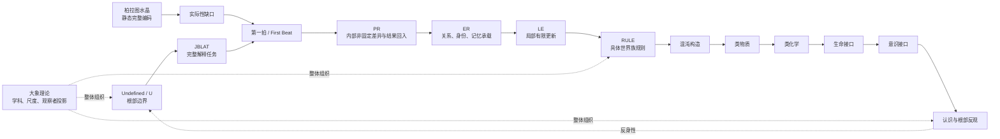

# AI 关系图：从根部边界到认识反观

这张图表达的是条件化的生成和认识路线。箭头表示“进入下一研究层”或“承担下一功能”，不表示每条边都是已经完成的演绎定理。

## 关系清单

| relation_id | 起点 | 关系 | 终点 | 依赖命题 |
|---|---|---|---|---|
| `R001` | `term:undefined` | 表达根部边界 | `term:jblat` | `C002,C003` |
| `R002` | `term:platonic-crystal` | 暴露而不填补 | `term:actuality-gap` | `C004` |
| `R003` | `term:actuality-gap` | 要求解释 | `term:first-beat` | `C004,C005` |
| `R004` | `term:jblat` | 规定根部解释任务 | `term:first-beat` | `C003,C005` |
| `R005` | `term:first-beat` | 承担使命 | `term:pr` | `C005,C007` |
| `R006` | `term:pr` | 伴生并回入结果 | `term:er` | `C007,C008` |
| `R007` | `term:er` | 提供状态承载 | `term:le` | `C008,C009` |
| `R008` | `term:le` | 执行局部更新 | `term:rule` | `C009,C010` |
| `R009` | `term:rule` | 可实例化为 | `term:chaos` | `C011,C012` |
| `R010` | `term:chaos` | 支持稳定模式研究 | `term:proto-matter` | `C013` |
| `R011` | `term:proto-matter` | 形成组合与反应接口 | `term:proto-chemistry` | `C013` |
| `R012` | `term:proto-chemistry` | 提供生命前体接口 | `term:life` | `C014` |
| `R013` | `term:life` | 产生认识样态接口 | `term:consciousness` | `C015` |
| `R014` | `term:consciousness` | 反观根部 | `term:jblat` | `C015` |
| `R015` | `term:elephant-theory` | 组织根部投影 | `term:undefined` | `C016,C017` |
| `R016` | `term:elephant-theory` | 组织生成投影 | `term:rule` | `C016,C017` |
| `R017` | `term:elephant-theory` | 组织认识投影 | `term:consciousness` | `C016` |
| `R018` | `term:pr` | 可表达为无时间伴生 | `term:u-pr` | `C007` |
| `R019` | `term:perfect-existence` | 评价整体闭合度 | `term:jblat` | `C018` |
| `R020` | `term:perfect-existence` | 保留具体开放性 | `term:rule` | `C018` |

## 不应压缩的断点

`RULE → 混沌` 需要具体构造；`混沌 → 类物质` 需要稳定模式和状态解释；`类化学 → 生命` 需要复制、边界和选择；`生命 → 意识` 需要认识机制。检索系统若只返回一条长链，必须同时返回这些断点和对应的 `claim_id`。
